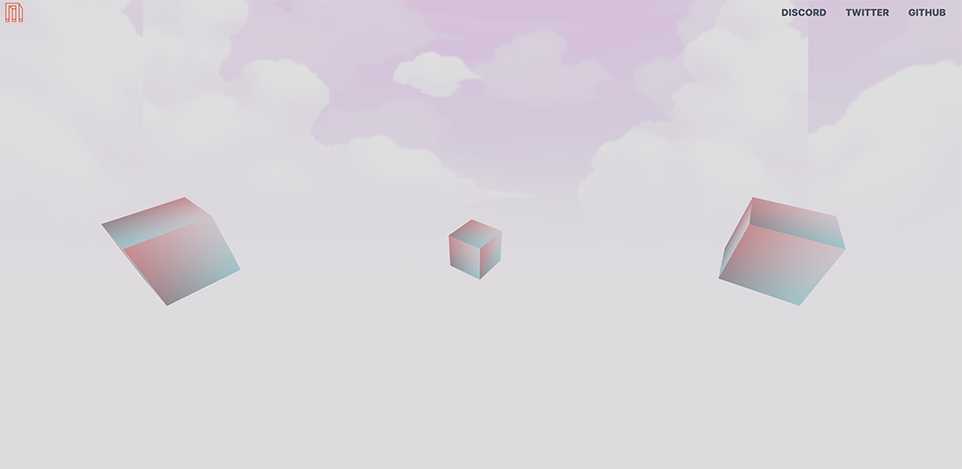
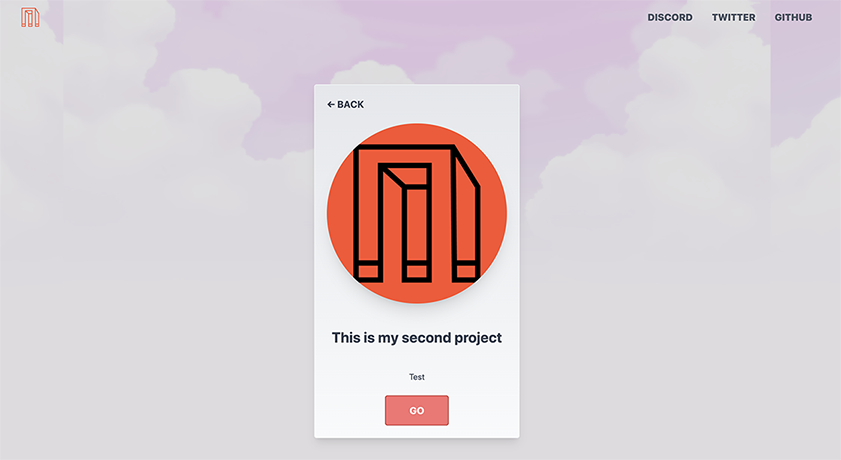

# Metaverse Builders DAO Member Portfolio Template

Screenshot of how the app currently looks like



# Quickstart
1. Run `yarn` to install dependencies.

2. Run `yarn dev` to start the project for development.

3. The project is readily deployable on Vercel. To deploy, fork this project into your github, and link your github to Vercel. 
You should be able to see your fork of the repo which you can then deploy.

# Todos
1. Design a square logo (1:1), and go to [https://realfavicongenerator.net/](https://realfavicongenerator.net/). Replace the logo files in `/public` to change the styling.

2. Go to `/src/config.jsx` and edit the following. Feel free to edit however you wish. 

Change the titleDefault, url, description, and author
```javascript
const titleDefault = 'Metaverse Builders DAO Portfolio Template'
const url = 'https://mbd.gg/'
const description =
  'Template for builders in the Metaverse Builders DAO'
const author = 'Metaverse Builders DAO'
```

Change the colors as according to realfavicongenerator.net
```javascript
        {/* Meta Tags for HTML pages on Mobile */}
        {/* <meta name="format-detection" content="telephone=yes"/>
        <meta name="HandheldFriendly" content="true"/>  */}
        <meta
          name='viewport'
          content='width=device-width, minimum-scale=1, initial-scale=1.0'
        />
        <link rel="apple-touch-icon" sizes="180x180" href="/apple-touch-icon.png" />
        <link rel="icon" type="image/png" sizes="32x32" href="/favicon-32x32.png" />
        <link rel="icon" type="image/png" sizes="16x16" href="/favicon-16x16.png" />
        <link rel="manifest" href="/site.webmanifest" />
        <link rel="mask-icon" href="/safari-pinned-tab.svg" color="#fc5130" />
        <meta name="msapplication-TileColor" content="#fc5130" />
        <meta name="theme-color" content="#fc5130"></meta>
```

Change the twitter account
```javascript
        {/* 
      Twitter Summary card
        documentation: https://dev.twitter.com/cards/getting-started
        Be sure validate your Twitter card markup on the documentation site. */}
        <meta name='twitter:card' content='summary' />
        <meta name='twitter:site' content='@MB__DAO' />
      </Head>
```

3. Go to `/src/components/dom/Navbar.jsx` and change the links as desired by you.
Be sure to change the color settings too!

```javascript
            
```

4. If you would like to change the skyboxes, they are found in `/public/skybox/` the coordinates are a little wonky.

5. Create your routes under `/src/pages/index.jsx`
```javascript
// canvas components goes here
// It will receive same props as Page component (from getStaticProps, etc.)
// Insert routes here
Page.r3f = (props) => (
  <>
    <Shader position={[4.5,0,0]} route="/page1" />
    <Shader position={[0,0,-4]} route="/page2" />
    <Shader position={[-4.5,0,0]} route="/page3" />
  </>
)
```

6. Under the pages in `/pages` you can create pages according to your routes. Rename the title to match the appropriate content
```javascript
export async function getStaticProps() {
  return {
    props: {
      title: 'Metaverse Portfolio',
    },
  }
}
```

# References
This project was bootstrapped with [`create-r3f-app`](https://github.com/utsuboco/create-r3f-app)